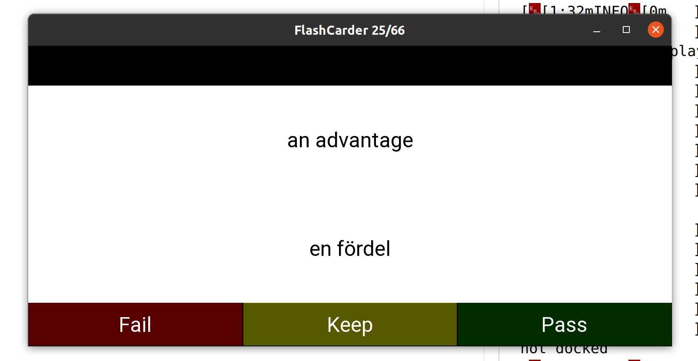

## Flashcard Application

This application is a flash card app in Python and can load the __saved google translate xslx files__ and add them to your dictionary. You can save your _saved google translation history_ and put the xlsx file in __google_files__ directory. The words will be imported into the dictionary and played to you for practice.

### flash_carder.py
The main file that loads the GUI and the dictionaries. To run the application, simply put your google translate saved xlsx files into _google_files_ folder and run _python flash_carder.py_.

### ui_main.py
Creates the GUI using Kivy.

### dict_funs.py

##### Class Word
- Contains each word, its translation, the number of times it has been guessed correctly/incorrectly, and the last time it was shown to the user.
- Should_show(): decides if this word can be shown to user or not based on the last used time and the number of pass/fail on the word.

##### Class DictHandler
- load_google_dict(): loads a google translate exported xlsx file and adds all the new words to _self.dictionary_. It ignores the word if it is already in the dictionary.
- load_dict(): 
  - Loads the _default dictionary_. Default dictionary is db.csv and contains all the words that have been added to the app and keeps their meta data (last used time, and number of pass/fail). 
  - This function also loads all the xlsx files found in _google_files_ folder and adds them to the default dictionary.
- save_dict(): Updates the default dictionary with the latest progress.
- export_as_word(): Exports the dictionary as _list.csv_
